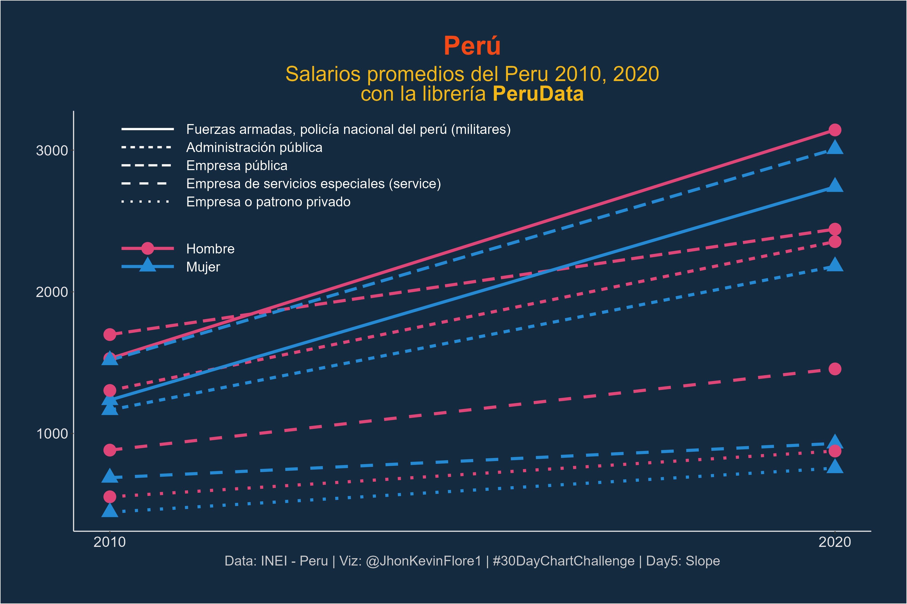
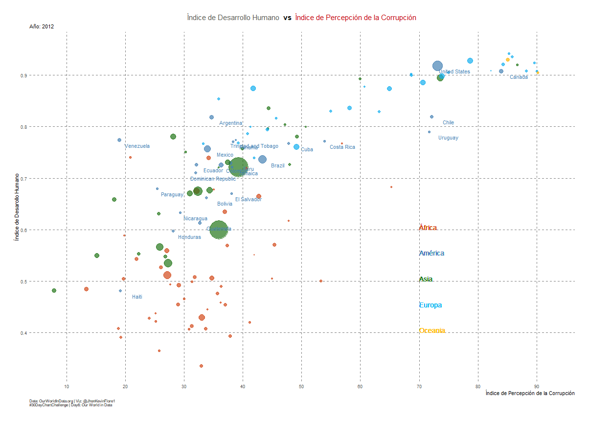
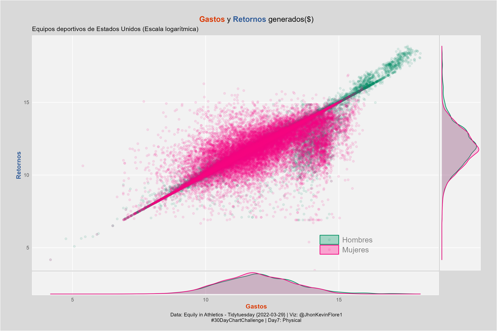
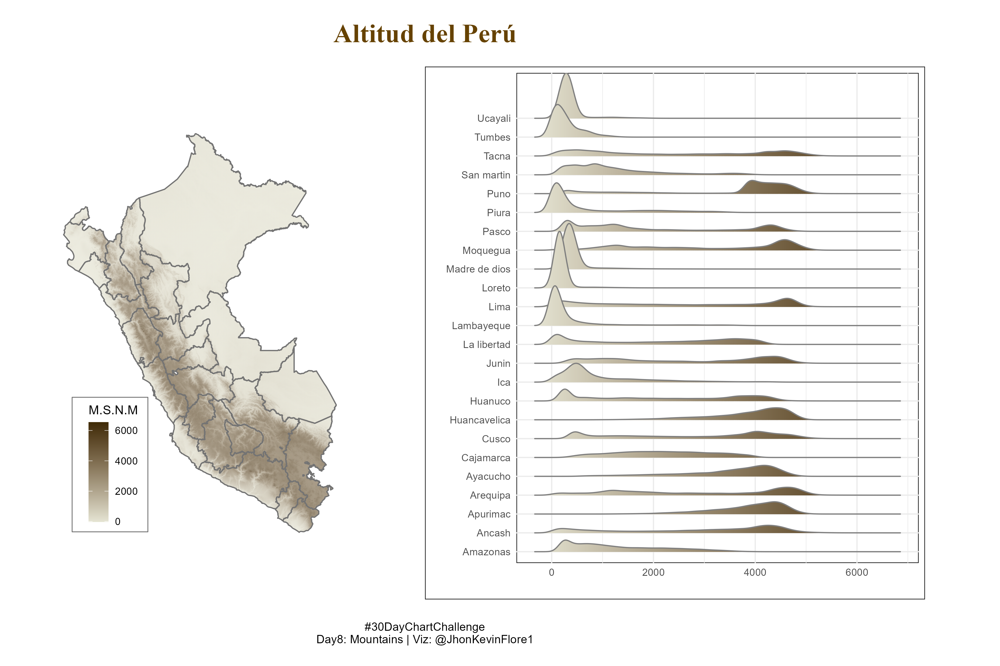
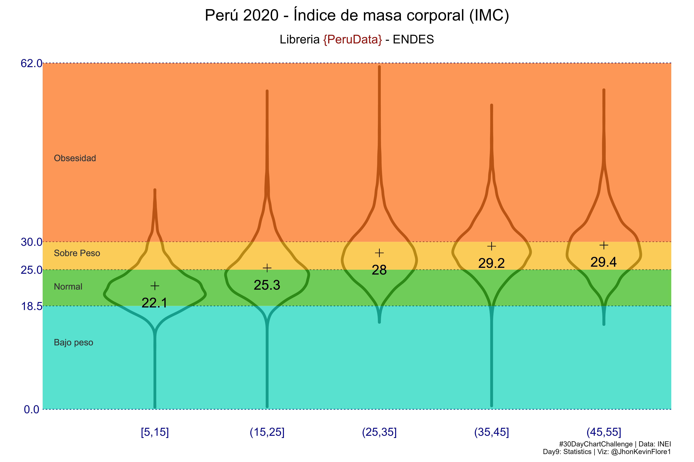
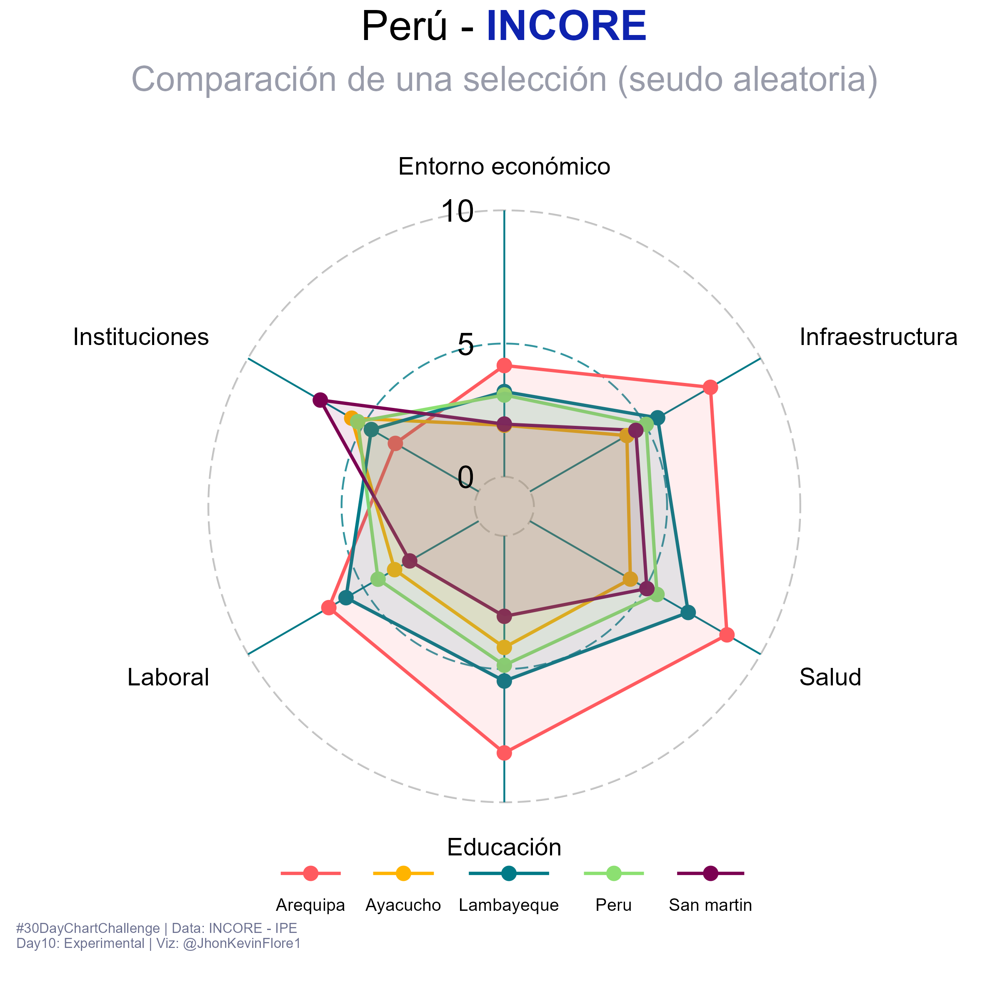

\#30dayChartChallenge
================

<!-- -->

# [Day 1: Part to whole](https://github.com/TJhon/30DayChartChallenge/blob/main/R/day1-part-to-whole.r)

<!-- -->

# [Day 2: Pictogram](https://github.com/TJhon/30DayChartChallenge/blob/main/R/day2-pictogram.r)

<!-- -->

# [Day 3: Historical](https://github.com/TJhon/30DayChartChallenge/blob/main/R/day3-historical.r)

<!-- -->

# [Day 4: Flora](https://github.com/TJhon/30DayChartChallenge/blob/main/R/day4-flora.r)

<!-- -->

# [Day 5: Slope](https://github.com/TJhon/30DayChartChallenge/blob/main/R/day5-slope.r)

<!-- -->

# [Day 6: Owid](https://github.com/TJhon/30DayChartChallenge/blob/main/R/day6-OWID.r)

<!-- -->

# [Day 7: Physical](https://github.com/TJhon/30DayChartChallenge/blob/main/R/day7-physical.r)

<!-- -->

# [Day 8: Mountains](https://github.com/TJhon/30DayChartChallenge/blob/main/R/day8-mountains.r)

<!-- -->

# [Day 9: Statistics](https://github.com/TJhon/30DayChartChallenge/blob/main/R/day9-statistics.r)

<!-- -->

# [Day 10: Experimental](https://github.com/TJhon/30DayChartChallenge/blob/main/R/day10-experimental.r)

<!-- -->
