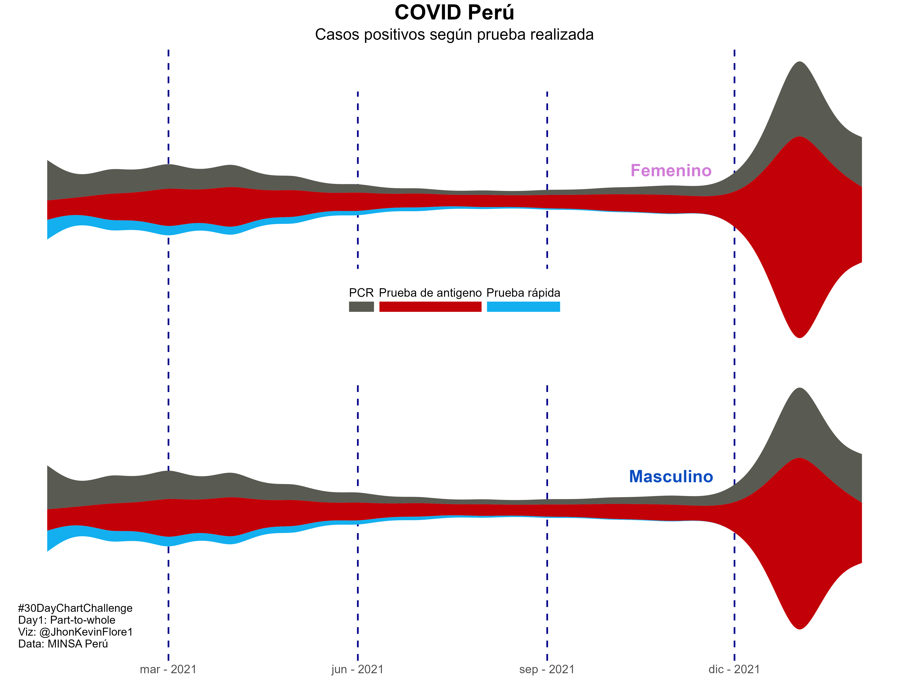
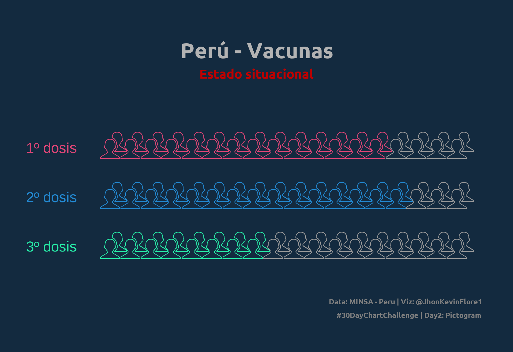
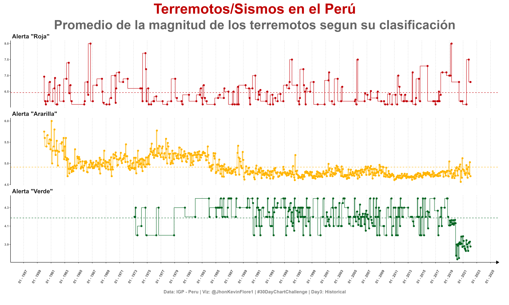
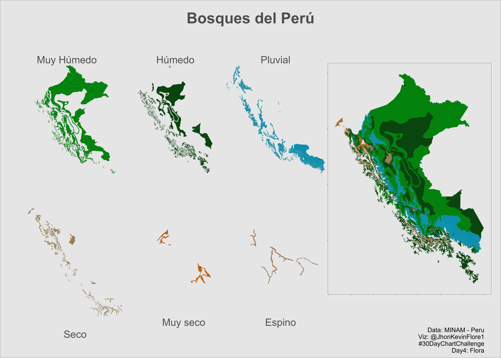

\#30dayChartChallenge
================

<!-- -->

# [Day 1: Part to whole](https://github.com/TJhon/30DayChartChallenge/blob/main/R/day1-part-to-whole.r)

<!-- -->

# [Day 2: Pictogram](https://github.com/TJhon/30DayChartChallenge/blob/main/R/day2-pictogram.r)

<!-- -->

# [Day 3: Historical](https://github.com/TJhon/30DayChartChallenge/blob/main/R/day3-historical.r)

<!-- -->

# [Day 4: Flora](https://github.com/TJhon/30DayChartChallenge/blob/main/R/day4-flora.r)

<!-- -->
