\#30dayChartChallenge
================

<!-- -->

# [Day 1: Part to whole](https://github.com/TJhon/30DayChartChallenge/blob/main/R/day1-part-to-whole.r)

<!-- -->

# [Day 2: Pictogram](https://github.com/TJhon/30DayChartChallenge/blob/main/R/day2-pictogram.r)

<!-- -->

# [Day 3: Historical](https://github.com/TJhon/30DayChartChallenge/blob/main/R/day3-historical.r)

<!-- -->

# [Day 4: Flora](https://github.com/TJhon/30DayChartChallenge/blob/main/R/day4-flora.r)

<!-- -->

# [Day 5: Slope](https://github.com/TJhon/30DayChartChallenge/blob/main/R/day5-slope.r)

<!-- -->

# [Day 6: Owid](https://github.com/TJhon/30DayChartChallenge/blob/main/R/day6-OWID.r)

<!-- -->

# [Day 7: Physical](https://github.com/TJhon/30DayChartChallenge/blob/main/R/day7-physical.r)

<!-- -->

# [Day 8: Mountains](https://github.com/TJhon/30DayChartChallenge/blob/main/R/day8-mountains.r)

<!-- -->

# [Day 9: Statistics](https://github.com/TJhon/30DayChartChallenge/blob/main/R/day9-statistics.r)

<!-- -->

# [Day 10: Experimental](https://github.com/TJhon/30DayChartChallenge/blob/main/R/day10-experimental.r)

<!-- -->

# [Day 11: Circular](https://github.com/TJhon/30DayChartChallenge/blob/main/R/day11-circular.r)

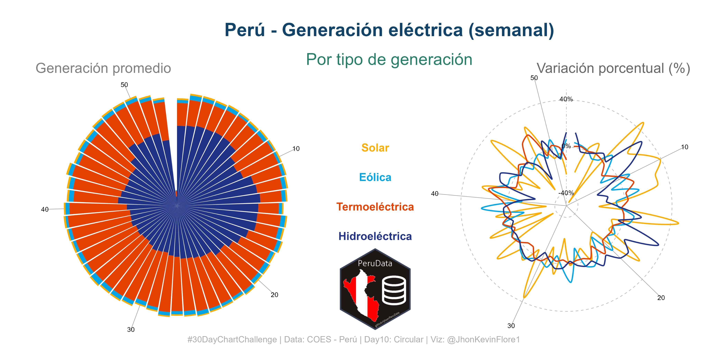

# [Day 12: The_economist](https://github.com/TJhon/30DayChartChallenge/blob/main/R/day12-the_economist.r)

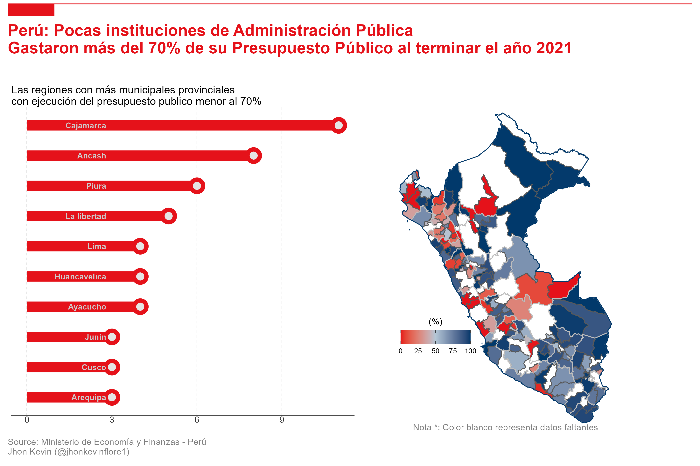<!-- -->

# [Day 13: Correlation](https://github.com/TJhon/30DayChartChallenge/blob/main/R/day13-correlation.r)

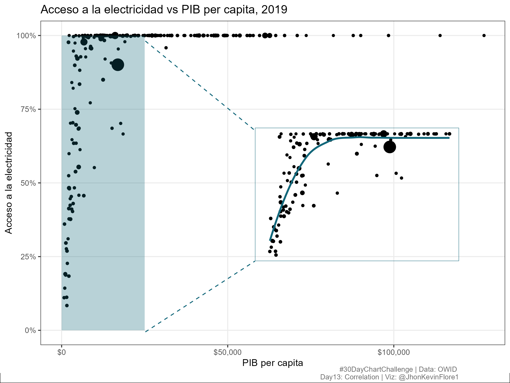<!-- -->

# [Day 14: 3d](https://github.com/TJhon/30DayChartChallenge/blob/main/R/day14-3d.r)

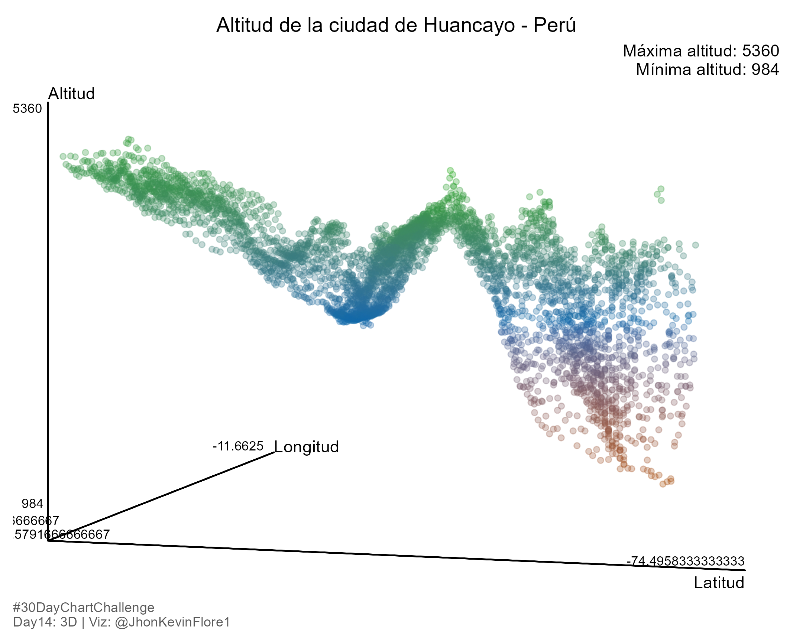<!-- -->

# [Day 15: Multivariable](https://github.com/TJhon/30DayChartChallenge/blob/main/R/day15-multivariable.r)

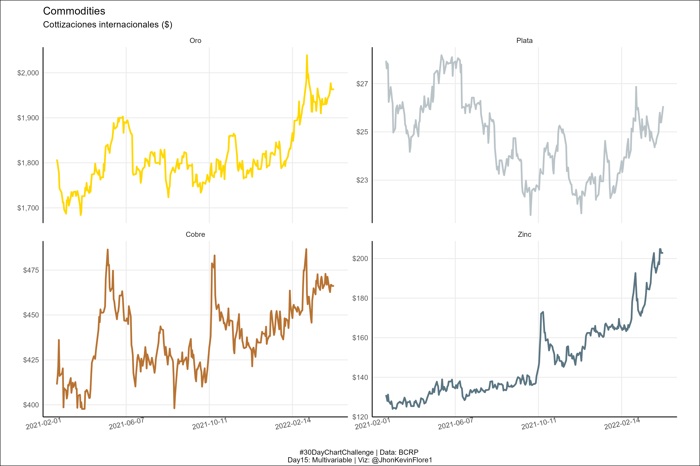<!-- -->

# [Day 16: Environment](https://github.com/TJhon/30DayChartChallenge/blob/main/R/day16-environment.r)

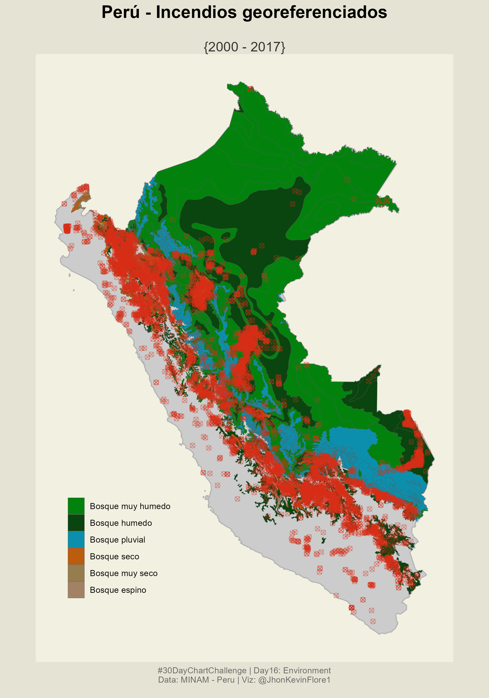<!-- -->

# [Day 17: Connections](https://github.com/TJhon/30DayChartChallenge/blob/main/R/day17-connections.r)

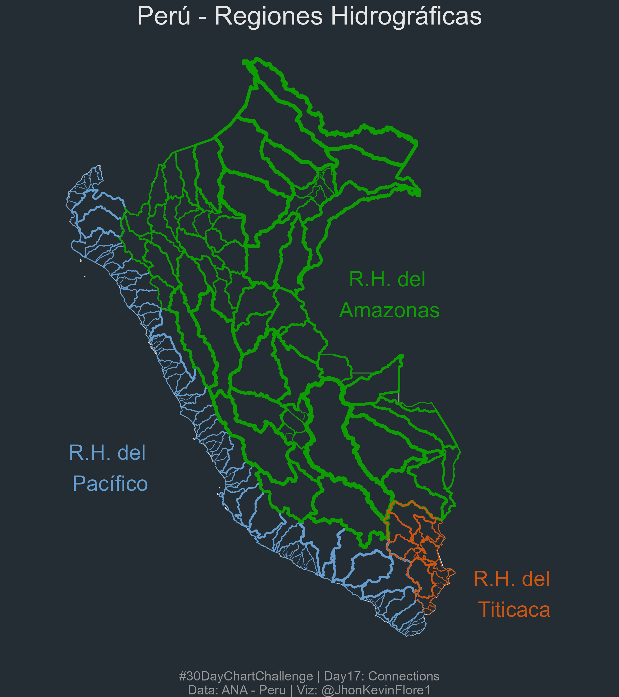<!-- -->

# [Day 18: Oecd](https://github.com/TJhon/30DayChartChallenge/blob/main/R/day18-oecd.r)

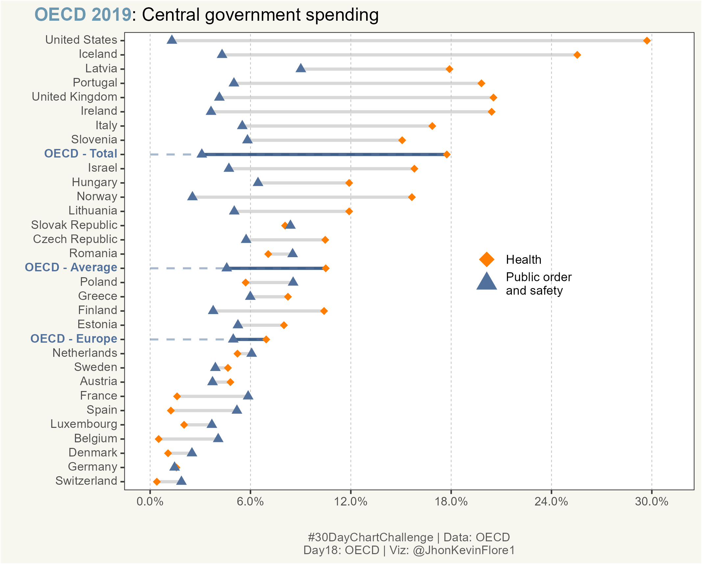<!-- -->

# [Day 19: Global-change](https://github.com/TJhon/30DayChartChallenge/blob/main/R/day19-global-change.r)

<!-- -->

# [Day 20: New tool](https://github.com/TJhon/30DayChartChallenge/blob/main/Julia/day20-new_tool.jl)

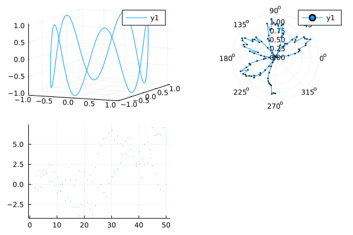<!-- -->

# [Day 21: Down_upwards](https://github.com/TJhon/30DayChartChallenge/blob/main/R/day21-down_upwards.r)

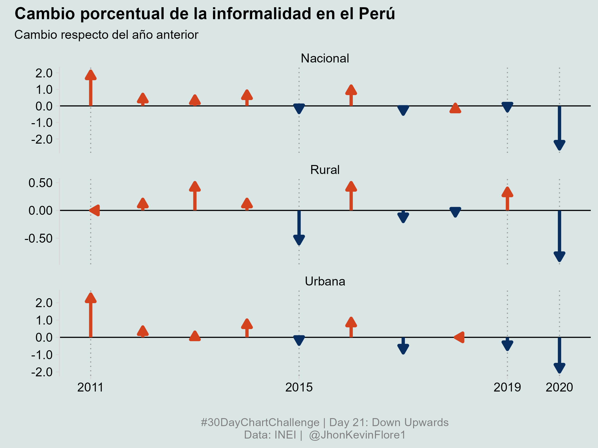<!-- -->

# [Day 22: Animation](https://github.com/TJhon/30DayChartChallenge/blob/main/R/day22-animation.r)

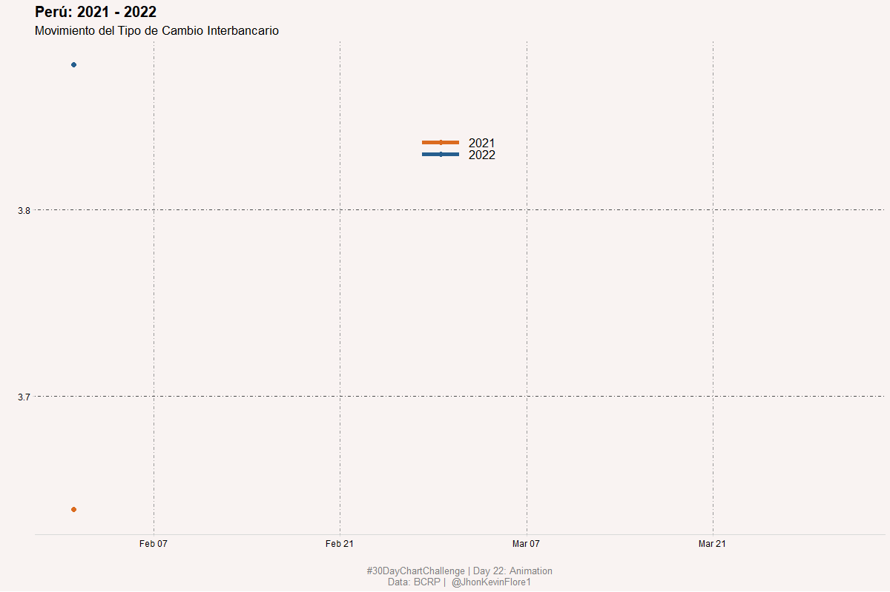<!-- -->

# [Day 23: Tiles](https://github.com/TJhon/30DayChartChallenge/blob/main/R/day23-tiles.r)

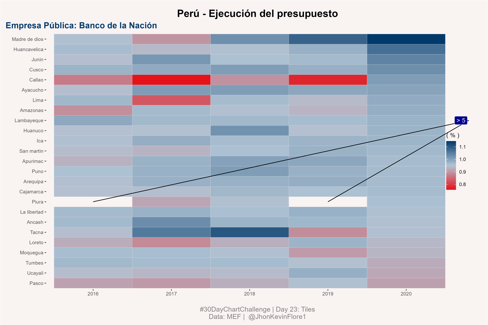<!-- -->

# [Day 24: Financial_theme](https://github.com/TJhon/30DayChartChallenge/blob/main/R/day24-financial_theme.r)

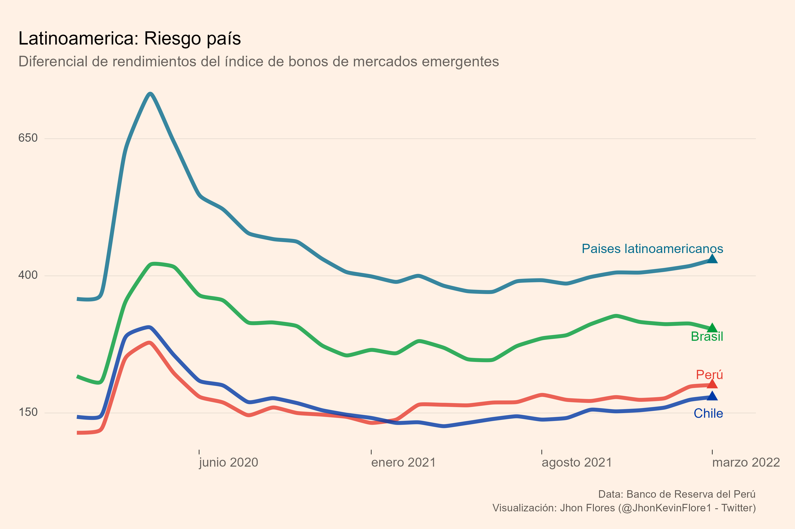<!-- -->
